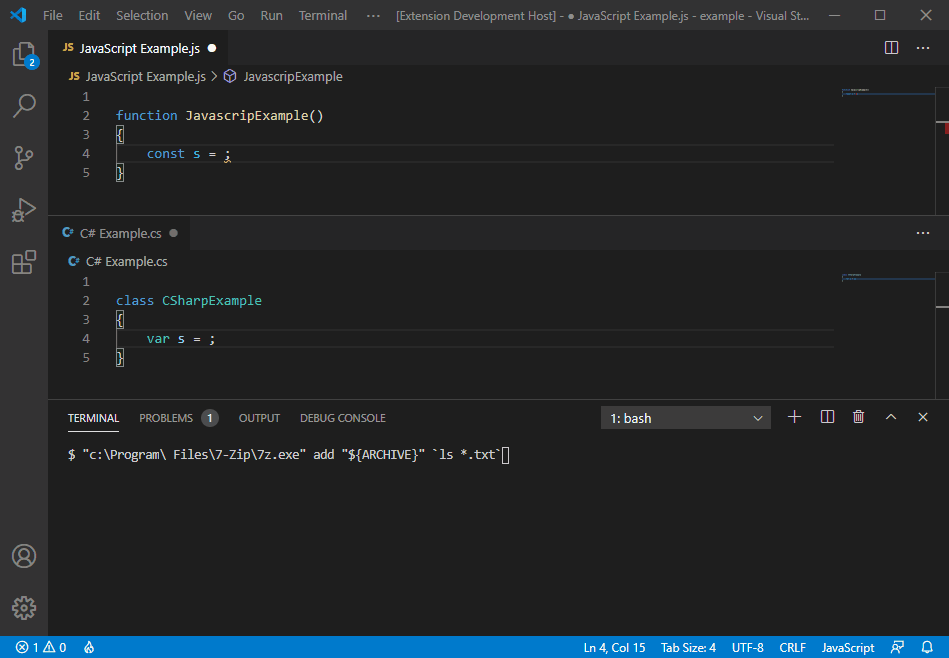

# Escape String - Visual Studio Code extension

Pasting strings into source code file can be challenging because special characters must be escaped. 
This **Escape String** VSCode extension helps you with that by adding `Paste escaped string` command.

## Features

`Paste escaped string` is available by right clicking on a text editor for supported types of files:
* C
* C++
* C#
* JavaScript
* TypeScript

It will paste content of clipboard as a string, in format specific for given file/programming language, with special characters escaped.

In this animation you can see that "original" text (command line) is copied to clipboard and then pasted to a *.cs and *.js file. The pasted string is formatted as verbatim string in C# and as template literal in JavaScript:

## Known issues

For C++ strings are escaped using raw string literal. If original string contains default end-sequence ") then we'll try one of pre-defined delimiters. If the string contains all pre-defined end-sequences, we will use the original string. Example: ``)" )!" )@" )#" )$" )%" )^" )&" )*" )~" )`" )-" )_" )=" )+"``

